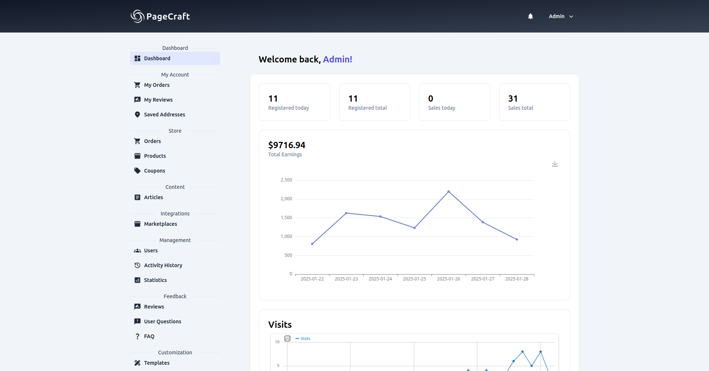

# PageCraft

PageCraft is a lightweight, free and open source CMS for your website.

    

## Technologies Used

-   **Backend:** PHP 8, Laravel 11
-   **Frontend:** Nuxt 3
-   **Database:** MySQL 8
-   **Testing:** PHPUnit
-   **Code Style and Static Analysis:** PHP - Larastan, JS - ESLint
-   **Containerization:** Custom docker-compose files
-   **Version Control:** Git
-   **Automation and CI/CD:** GitHub Actions, GitLab CI
-   **Full-text Search:** Meilisearch
-   **Web Analytics:** Matomo

    
    

## Application Management

Available `make` commands:

### General

-   `make start` - start the frontend and backend
-   `make stop` - stop the frontend and backend
-   `make restart` - restart the frontend and backend
-   `make update` - update the application

### Frontend

-   `make start_frontend` - start the frontend
-   `make stop_frontend` - stop the frontend
-   `make restart_frontend` - restart the frontend
-   `make logs_frontend` - view frontend logs
-   `make update_frontend` - update the frontend

### Backend

-   `make start_backend` - start the backend
-   `make stop_backend` - stop the backend
-   `make restart_backend` - restart the backend
-   `make logs_backend` - view backend logs
-   `make update_backend` - update the backend

## Additional Features

### Matomo

To collect web analytics, **Matomo** is installed in the application. Access its web interface at: [localhost:8082](http://localhost:8082)

    

### PhpMyAdmin

To simplify MySQL database management, **PhpMyAdmin** is installed in the application. You can access its web interface at: [localhost:8081](http://localhost:8081)

### RedisInsight

To manage Redis in the application, **RedisInsight** is installed. You can access its web interface at: [localhost:5540](http://localhost:5540). Use **redis** as the host for connection.

    

### MailHog

To track email sending in the application, **Mailhog** is installed. You can access its web interface at: [localhost:8025](http://localhost:8025)

    

### Meilisearch

To manage search in the application, **Meilisearch** is installed. You can access its web interface at: [localhost:7700](http://localhost:7700)

    

### Supervisor

To manage asynchronous tasks in the application, **Supervisor** is installed.
