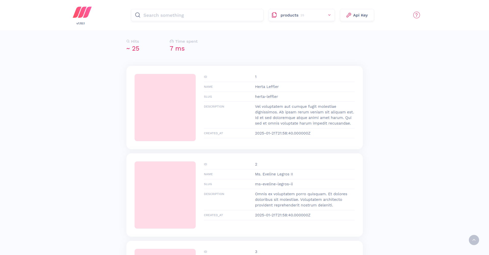

# PageCraft

PageCraft is a lightweight, free and open source CMS for your website.

    

## Используемые технологии

-   **Backend:** PHP 8, Laravel 11
-   **Frontend:** Nuxt 3
-   **БД:** MySQL 8
-   **Тестирование:** PHPUnit
-   **Кодстайл и Статический Анализ:** PHP - Larastan, JS - ESLint
-   **Контейнеризация:** Самописные docker-compose файлы
-   **Контроль версий:** Git
-   **Автоматизация и CI/CD:** GitHub Actions, GitLab CI
-   **Полнотекстовый поиск:** Meilisearch
-   **Веб-аналитика:** Matomo

    
	 

## Управление приложением

Доступные `make` команды:

### Общие

-   `make start` - запустить фронтенд и бэкенд
-   `make stop` - остановить фронтенд и бэкенд
-   `make restart` - перезапустить фронтенд и бэкенд
-   `make update` - обновить приложение

### Frontend

-   `make start_frontend` - запустить фронтенд
-   `make stop_frontend` - остановить фронтенд
-   `make restart_frontend` - перезапустить фронтенд
-   `make logs_frontend` - просмотреть логи фронтенда
-   `make update_frontend` - обновить фронтенд

### Backend

-   `make start_backend` - запустить бэкенд
-   `make stop_backend` - остановить бэкенд
-   `make restart_backend` - перезапустить бэкенд
-   `make logs_backend` - просмотреть логи бэкенда
-   `make update_backend` - обновить бэкенд

## Дополнительные возможности

### Matomo

Для сбора веб-аналитики в приложении установлен **Matomo**. Получить доступ к его веб-интерфейсу можно по адресу: [localhost:8082](http://localhost:8082)

    

### PhpMyAdmin

Для облегчения управления базой MySQL в приложении установлен **PhpMyAdmin**. Получить доступ к веб-интерфейсу можно по адресу: [localhost:8081](http://localhost:8081)

### RedisInsight

Для управления Redis в приложении установлен **RedisInsight**. Получить доступ к его веб-интерфейсу можно по адресу: [localhost:5540](http://localhost:5540). В качестве хоста для подключения нужно использовать **redis**

    

### MailHog

Для отслеживания отправки почты в приложении установлен **Mailhog**. Получить доступ к его веб-интерфейсу можно по адресу: [localhost:8025](http://localhost:8025)

    

### Meilisearch

Для управления поиском в приложении установлен **Meilisearch**. Получить доступ к его веб-интерфейсу можно по адресу: [localhost:7700](http://localhost:7700)

    

### Supervisor

Для управления ассинхронными задачами в приложении установлен **Supervisor**
